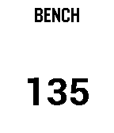
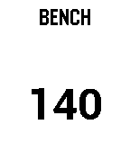
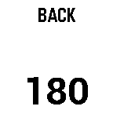

# gymcomp
Gym companion app for Pebble

App can be installed on a Pebble smartwatch using Pebbles developer tools.  This requires the Pebble SDK to be installed on your computer.  (See http://developer.getpebble.com)

Currently exercises are hard-coded.  A companion phone app could eventually be used to set up workouts, allow you to switch between saved workouts, etc.

### Usage:

The select button toggles between view and edit modes.

In view mode, the up and down buttons switch between exercises.
In edit mode, the up and down buttons increment/decremet the weight of the current exercise.

When you open the app you should see a screen like this:

You can press the select button to enter edit mode:

Then you can press the up button to increment the weight (pressing the down button will decrement the weight):

When you press the select button again the new weight will be saved:

From view mode you can press the up or down buttons to switch to the next or previous exercise:

